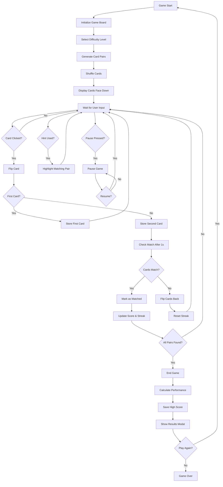

# Memory Flip Game



## Overview

Memory Flip Game is a classic card-matching concentration game built with vanilla HTML, CSS, and JavaScript. Players flip cards to find matching pairs while racing against time and minimizing moves to achieve the highest score.

## Features

### Core Gameplay
- **Three Difficulty Levels**
  - Easy: 4x4 grid (8 pairs)
  - Medium: 6x4 grid (12 pairs)  
  - Hard: 6x6 grid (18 pairs)

- **Scoring System**
  - Base score multiplied by difficulty
  - Streak bonuses for consecutive matches
  - Time bonuses for quick completion
  - Performance rating with 5-star system

### Game Mechanics
- **Timer**: Tracks elapsed game time
- **Move Counter**: Records number of card flips
- **Streak System**: Rewards consecutive matches
- **Hint System**: 3 hints per game to reveal matching pairs
- **Pause/Resume**: Pause game at any time

### Visual Features
- **Multiple Emoji Themes**: Animals, Food, Nature, Objects
- **Smooth Animations**: Card flips, matches, celebrations
- **Responsive Design**: Works on desktop and mobile
- **Score Popups**: Visual feedback for points earned
- **Performance Indicators**: Shake animation for mismatches

### Data Persistence
- **Local Leaderboard**: Top 5 scores saved locally
- **Game Statistics**: Time, moves, score, difficulty tracking
- **Sample Data**: Pre-populated leaderboard for new users

## File Structure

```
memory-flip-game/
├── index.html          # Main HTML structure
├── style.css           # All styling and animations
├── main.js             # Game logic and functionality
└── README.md           # This documentation
```

## Technical Implementation

### HTML Structure
- Semantic HTML5 elements
- Accessible button controls
- Modal dialogs for game states
- Grid-based card layout

### CSS Features
- CSS Grid for responsive card layouts
- CSS Custom Properties for theming
- 3D transforms for card flip animations
- Media queries for mobile optimization
- Flexbox for component alignment

### JavaScript Architecture
- **Class-based Design**: `MemoryGame` class encapsulates all functionality
- **Event-driven**: Handles clicks, keyboard shortcuts, modal interactions
- **State Management**: Tracks game state, scores, timing
- **Local Storage**: Persists leaderboard data
- **Performance Optimization**: Efficient DOM manipulation

## Game Controls

### Mouse/Touch
- Click cards to flip them
- Click difficulty buttons to change level
- Click control buttons for actions
- Click modal backgrounds to close

### Keyboard Shortcuts
- **Space**: Pause/Resume game
- **H**: Use hint (if available)
- **R**: Reset/New game

## Scoring Algorithm

```javascript
baseScore = 100 * difficultyMultiplier
streakBonus = currentStreak * 10
timeBonus = max(0, maxTimeBonus - elapsedSeconds)
totalScore = baseScore + streakBonus + timeBonus
```

### Difficulty Multipliers
- Easy: 1.0x
- Medium: 1.5x
- Hard: 2.0x

## Performance Rating

Performance is calculated based on:
- **Time Score**: Faster completion = higher score
- **Move Efficiency**: Fewer moves = higher score  
- **Streak Performance**: Longer streaks = higher score

### Star Ratings
- ⭐⭐⭐⭐⭐ Perfect! (250+ points)
- ⭐⭐⭐⭐☆ Excellent! (200-249 points)
- ⭐⭐⭐☆☆ Great! (150-199 points)
- ⭐⭐☆☆☆ Good! (100-149 points)
- ⭐☆☆☆☆ Keep practicing! (<100 points)

## Browser Compatibility

- **Modern Browsers**: Chrome 60+, Firefox 55+, Safari 12+, Edge 79+
- **Mobile**: iOS Safari 12+, Chrome Mobile 60+
- **Features Used**: CSS Grid, Flexbox, ES6 Classes, Local Storage

## Installation & Setup

1. **Download Files**
   ```bash
   # Clone or download the project files
   # No build process required
   ```

2. **Open in Browser**
   ```bash
   # Simply open index.html in any modern web browser
   # Or serve via local web server for best experience
   ```

3. **Optional: Local Server**
   ```bash
   # Python 3
   python -m http.server 8000
   
   # Node.js
   npx serve .
   
   # PHP
   php -S localhost:8000
   ```

## Customization

### Adding New Emoji Themes
```javascript
// In main.js, add to emojiSets object
newTheme: ['🎯', '🎮', '🎲', '🎪', '🎭', '🎨', '🎬', '🎤']
```

### Adjusting Difficulty
```javascript
// Modify difficulties object in main.js
custom: {rows: 8, cols: 8, pairs: 32, timeBonus: 25, scoreMultiplier: 3}
```

### Styling Changes
```css
/* Modify CSS custom properties in style.css */
:root {
  --primary-color: #your-color;
  --card-size-easy: 80px;
}
```

## Performance Optimizations

- **Efficient DOM Updates**: Minimal DOM manipulation
- **Event Delegation**: Single event listeners where possible
- **CSS Animations**: Hardware-accelerated transforms
- **Memory Management**: Proper cleanup of intervals and events
- **Responsive Images**: No external image dependencies

## Accessibility Features

- **Keyboard Navigation**: Full keyboard support
- **Semantic HTML**: Screen reader friendly
- **High Contrast**: Clear visual distinctions
- **Focus Indicators**: Visible focus states
- **ARIA Labels**: Descriptive labels for interactive elements

## Future Enhancements

- **Sound Effects**: Audio feedback for actions
- **Multiplayer Mode**: Local or online multiplayer
- **Custom Themes**: User-uploaded image sets
- **Statistics Dashboard**: Detailed game analytics
- **Achievement System**: Unlock rewards for milestones
- **Progressive Web App**: Offline functionality

## License

This project is open source and available under the MIT License.

## Contributing

Contributions are welcome! Please feel free to submit pull requests or open issues for bugs and feature requests.

---

**Enjoy playing Memory Flip Game!** 🎮✨